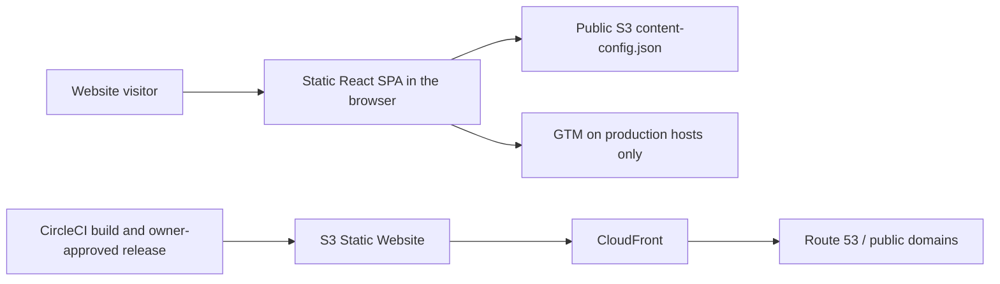

# AHurynovich CV Architecture

This document describes the verified current architecture at commit `1cf6119823d35bf0504b6521da736912ec2b53ec`. Code and configuration are authoritative when current behavior differs from documentation. Product direction belongs in [`ROADMAP.md`](ROADMAP.md), experience behavior in [`DESIGN.md`](DESIGN.md), and significant future technical rationale in the [ADR registry](_docs/decisions/README.md).

## System context



The repository contains one client application. It has no backend, database, authentication, server-side rendering, queue, or real-time channel.

## Application and deployables

| Area | Current responsibility | Source |
| --- | --- | --- |
| React application | Browser UI, navigation, localization, accessible interactions | `src/` |
| Redux Toolkit + Redux Saga | Client state and initialization side effects | `src/store/` |
| Webpack | Development server and static production bundle | `config/webpack/` |
| `dist` | Ignored deployable SPA artifact | `config/environment/environment.config.js` |
| Storybook | Optional component-library artifact in `storybook-static` | `config/storybook/` |

Webpack emits `dist/index.html`, JavaScript chunks, extracted CSS, fonts, images, favicons, `robots.txt`, and `sitemap.xml`. The optional PWA build adds a generated service worker; the normal production and preview builds do not enable it.

## Routing and render flow

The application uses `BrowserRouter` and lazy-loaded route components:

| Route | Component |
| --- | --- |
| `/` | Main page |
| `/experience` | Experience page |
| `/passions` | Passions page, currently under construction |
| `*` | Not Found page |

Initialization is browser-only:

```text
index.ts
  -> create browser services
  -> create Redux store and run initialization sagas
  -> fetch public content config and initialize locale/device state
  -> render React application
  -> BrowserRouter lazy-loads the current page
```

Development hosting enables `historyApiFallback`. Every static preview and production edge configuration must likewise return `index.html` for valid client-side deep links. A host that treats `/experience` as a physical file path will return a hosting-layer 404 before React can render.

## External content and trust boundaries

The browser fetches:

```text
https://ahurynovich-cv-config.s3.eu-west-1.amazonaws.com/content-config.json
```

The external JSON owns CV content such as the PDF URL, profile copy, skills, experience, projects, contact data, and social links. The repository owns the expected TypeScript shape and presentation. Translatable external fields prefer the selected RU/EN value and fall back to English.

Trust boundaries:

- All application code and public assets execute in the visitor's browser; frontend controls are not an authorization boundary.
- The content endpoint is public cross-origin input and must be treated as untrusted. Markup rendering must preserve the existing sanitization boundary.
- The website is public and stores no authenticated user data in this repository.
- Production analytics is allowed only on `ahurynovich.com` and `www.ahurynovich.com`; every other hostname must return before a GTM request is created.
- AWS and analytics credentials do not belong in the bundle, repository, preview artifact, or documentation.

## Environments

| Environment | Build/runtime | Analytics | Operational boundary |
| --- | --- | --- | --- |
| Local development | Webpack development server on port 1337 | Disabled by hostname | Developer machine; SPA fallback from dev server |
| Static preview | Production-style Webpack output served from ignored `dist` | Disabled by hostname | Non-production review; host must provide SPA fallback |
| Production | Production-style `dist` on S3 behind CloudFront and Route 53 | Enabled only on canonical production hosts | Owner-controlled CircleCI deployment |

The static preview host does not execute a build command. `npm run preview:build` must create an exact-revision `dist/index.html` in the current worktree before preview handoff. Preview availability is evidence for review, not production acceptance.

## Cross-cutting operational contracts

| Concern | Current contract |
| --- | --- |
| Authentication and authorization | Not applicable: every route and repository-owned asset is public; frontend UI is not an authorization boundary |
| Transport | Production pages and public content are expected over HTTPS; the S3 content endpoint permits public cross-origin reads |
| Output safety | React escapes rendered values by default; the two external-markup surfaces use `sanitize-html` before `dangerouslySetInnerHTML` |
| Secrets | Production credentials are supplied to owner-controlled CircleCI jobs; no value belongs in source, `dist`, documentation, or previews |
| Runtime observability | Browser console errors, production usage analytics, CircleCI results, reports, Codecov, Snyk, and Lighthouse are available; no dedicated runtime error-monitoring service is configured in this repository |
| Backup and durability | The application owns no runtime database or user data. Backup/versioning policy for external content and AWS infrastructure is outside this repository and is not documented here |
| Rollback | No automated rollback procedure is defined in the repository. Production release remains a manual owner decision; a rollback requires an explicitly selected previously known-good artifact/revision and separate deployment approval |

## CI/CD and production topology

CircleCI is the existing CI/CD and release pipeline:

1. Feature branches install dependencies, lint, type-check, run Jest, and build the app.
2. `main` additionally produces test reports, runs Snyk, builds the app, adds the commit SHA, and runs Lighthouse.
3. Application deployment pauses at a manual approval job.
4. After owner approval, CircleCI syncs `dist` to S3 and invalidates CloudFront caches.
5. Storybook has a separate manual approval, build, and S3 deployment path.

Release readiness, human acceptance, application deployment, Storybook deployment, and cache invalidation are distinct boundaries. Repository agents do not perform production deployment autonomously.

No Dockerfile, Docker Compose, container runtime, or container deployment is required for this static application. Production deployment remains unchanged.

## Failure modes

| Failure | Current behavior / boundary |
| --- | --- |
| Content endpoint unavailable or network request fails | The error is logged, the API returns `null`, and initialization continues with empty default content. There is no dedicated visible recovery state. |
| Content JSON is invalid | JSON parsing is caught by the same path; the application continues with empty defaults. |
| Content shape is valid JSON but incompatible | There is no runtime schema validator; downstream selectors/components may show incomplete content or fail. |
| Deep-link SPA fallback missing | The hosting layer returns 404 before `BrowserRouter` runs. |
| Unknown client route with fallback working | React renders the localized Not Found page. |
| Stale CloudFront cache | A deployed revision may not be visible until cache invalidation completes; CircleCI performs invalidation only after deployment. |
| Stale preview artifact | The preview can differ from the pull-request HEAD; rebuild `dist` from the exact revision and verify it before review. |
| Analytics guard regression | A non-production host could contact GTM; `npm run test:analytics` checks the generated HTML without sending network requests. |

Future changes that alter these boundaries or introduce meaningful architectural alternatives require owner approval and an ADR.
