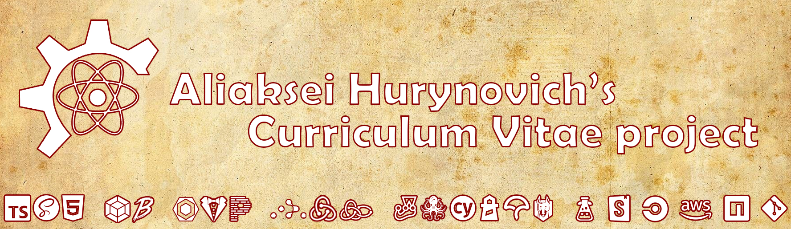

# AHurynovich CV



A public personal CV web application for Aliaksei Hurynovich, built with React and TypeScript. It presents professional background, skills, projects, colleague feedback, downloadable CV, and contact paths in English and Russian.

> **Status:** the production MVP is complete. Product-level post-MVP direction is recorded in [`ROADMAP.md`](ROADMAP.md); executable work and delivery status live in [GitHub Project 1](https://github.com/users/Shagon1k/projects/1).

[Production website](https://ahurynovich.com) · [CircleCI](https://app.circleci.com/pipelines/github/Shagon1k/AHurynovich-CV) · [MIT License](LICENSE)

## Quick start

Requirements: Node 20 and npm 10.

```bash
npm ci
npm start
```

The Webpack development server opens `http://localhost:1337` and provides client-side route fallback.

## Main commands

| Task | Command |
| --- | --- |
| Install exact dependencies | `npm ci` |
| Start development server | `npm start` |
| Development build | `npm run build:dev` |
| Production build | `npm run build:prod` |
| Clean production-style static preview | `npm run preview:build` |
| Unit/integration tests | `npm run test:ci` |
| Lint scripts and styles | `npm run lint` |
| Type-check | `npm run test:tsc` |
| Verify analytics boundary in built HTML | `npm run test:analytics` after `npm run preview:build` |
| Start Storybook | `npm run storybook:start` |
| Build Storybook | `npm run storybook:build` |

Focused Jest, Cypress, Lighthouse, PWA, report, lint-fix, and Storybook commands remain documented in [`package.json`](package.json) and the [testing guide](_docs/testing.md). Production deployment commands are intentionally excluded from the normal development workflow and require separate owner approval.

The separately deployed [Storybook component library](http://ahurynovich-cv-components-library-s3.s3-website-eu-west-1.amazonaws.com/) remains available as an optional UI reference.

## Architecture at a glance

```text
Browser
  -> React 18 + TypeScript static CSR application
  -> BrowserRouter routes: /, /experience, /passions, *
  -> public S3 content-config.json

Webpack production build
  -> ignored dist/
  -> S3 Static Website -> CloudFront -> Route 53
```

There is no backend, database, authentication, or container runtime. `dist/index.html` is the required application artifact for static preview and production-style hosting. A static host must route valid SPA deep links back to `index.html`.

Production deployment remains an owner-controlled CircleCI action behind manual approval. Building a preview, accepting a release, deploying to S3, deploying Storybook, and invalidating CloudFront are separate boundaries. See [`ARCHITECTURE.md`](ARCHITECTURE.md) and the [CI/CD guide](_docs/branching-strategy-and-ci-cd.md).

## Repository

```text
src/            React application, state, services, styles, and assets
config/         Webpack, Jest, Cypress, Lighthouse, lint, and Storybook config
_docs/          Human-facing guides and architecture decisions
.agent-docs/    Reusable repository rules for coding agents
.circleci/      Existing CI/CD and owner-approved release pipeline
.github/        Issue Forms, pull-request template, and GitHub Actions
```

Detailed source and configuration conventions are preserved in [`src/README.md`](src/README.md) and [`config/README.md`](config/README.md).

## Documentation

| If you want to... | Read |
| --- | --- |
| Navigate all project documentation | [`_docs/README.md`](_docs/README.md) |
| Understand current system boundaries | [`ARCHITECTURE.md`](ARCHITECTURE.md) |
| Review visual and accessibility expectations | [`DESIGN.md`](DESIGN.md) |
| See post-MVP product direction | [`ROADMAP.md`](ROADMAP.md) |
| Run and write tests | [`_docs/testing.md`](_docs/testing.md) |
| Follow TypeScript conventions | [`_docs/typescript.md`](_docs/typescript.md) |
| Understand CI/CD and production controls | [`_docs/branching-strategy-and-ci-cd.md`](_docs/branching-strategy-and-ci-cd.md) |
| Work with optional PWA support | [`_docs/pwa.md`](_docs/pwa.md) |
| Work with typography and fonts | [`_docs/typography.md`](_docs/typography.md) |

Repository agent instructions are in [`AGENTS.md`](AGENTS.md). Claude Code loads the same canonical contract through [`CLAUDE.md`](CLAUDE.md).

## License

[MIT](LICENSE) — Aliaksei Hurynovich.
