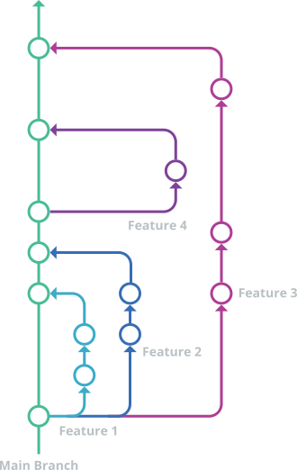
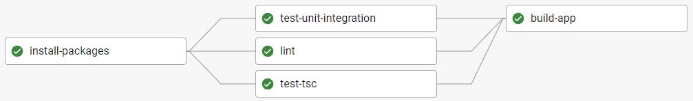
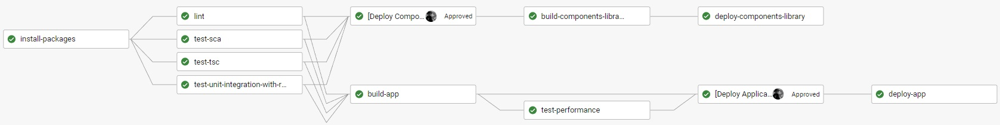

# Branching Strategy and CI/CD

This guide preserves the repository's GitHub Flow and existing CircleCI production model. The detailed agent workflow is in [`AGENTS.md`](../AGENTS.md) and [`.agent-docs/rules/git.md`](../.agent-docs/rules/git.md).

## GitHub Flow

- `main` is the production-ready integration branch.
- Work happens on short-lived branches and returns through a reviewed pull request.
- Issue delivery branches use `AH-<github-issue-number>_<short-slug>`.
- Commits and pull-request titles follow Conventional Commits.
- Pull requests are squash-merged by the owner.
- Every delivery pull request links its GitHub Issue from [Project 1](https://github.com/users/Shagon1k/projects/1).

Do not use the historical `[AH-X]` commit header or manual Issue-number placeholder. Do not bypass Husky/commitlint hooks with `--no-verify`.



## Local quality gates

The usual verification sequence is:

```bash
npm ci
npm run lint
npm run test:tsc
npm run test:ci
npm run preview:build
npm run test:analytics
```

Webpack uses Babel to transpile TypeScript, so `npm run test:tsc` is a separate required type-safety gate. Select additional Cypress, Lighthouse, PWA, or Storybook checks according to the changed behavior.

## Static preview

`npm run preview:build` cleans and creates the production-style `dist` artifact. The static preview host does not run a build command, so the current worktree must retain an ignored `dist/index.html` built from the exact revision under review.

The host must serve `index.html` for client-side deep links such as `/experience` and `/passions`. Preview analytics is disabled by hostname and `npm run test:analytics` verifies the built guard without network requests.

Preview readiness is not production acceptance or deployment.

## CircleCI

The authoritative pipeline is [`.circleci/config.yml`](../.circleci/config.yml).

| Job | Responsibility |
| --- | --- |
| `install-packages` | Install npm dependencies and cache `node_modules` by lockfile checksum |
| `lint` | Run ESLint and Stylelint |
| `test-tsc` | Run TypeScript checking without emit |
| `test-unit-integration` | Run Jest on feature branches |
| `test-unit-integration-with-reports` | Run Jest with JUnit and coverage reports on `main` |
| `test-sca` | Run the configured Snyk dependency scan on `main` |
| `build-app` | Create production `dist` and persist it to the CircleCI workspace |
| `add-last-commit-sha` | Add the built revision to `dist/index.html` |
| `test-performance` | Run Lighthouse CI against `dist` |
| `deploy-app` | Sync `dist` to the production S3 website after manual approval |
| `invalidate-app-cache` | Invalidate the production CloudFront caches after deployment |
| Storybook jobs | Build and, after separate manual approval, deploy `storybook-static` |

Feature workflow:



`main` workflow:



GitHub Actions additionally provide CodeQL scanning and the repository's Claude Code integration. They do not replace CircleCI as the CI/CD or release pipeline.

## Production boundary

Production remains S3 Static Website + CloudFront + Route 53. CircleCI pauses at explicit approval jobs before application or Storybook deployment.

Release readiness, owner acceptance, production deployment, and cache invalidation are separate actions. Agents must not run application/Storybook deploy scripts, invoke CloudFront invalidation, change AWS/CircleCI settings, or access production credentials without separate explicit owner approval.

No Dockerfile, Docker Compose setup, or container deployment is required for this project.
